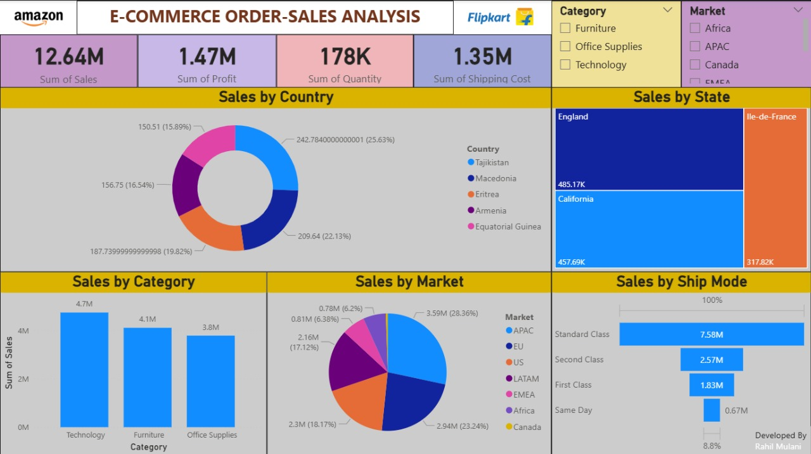
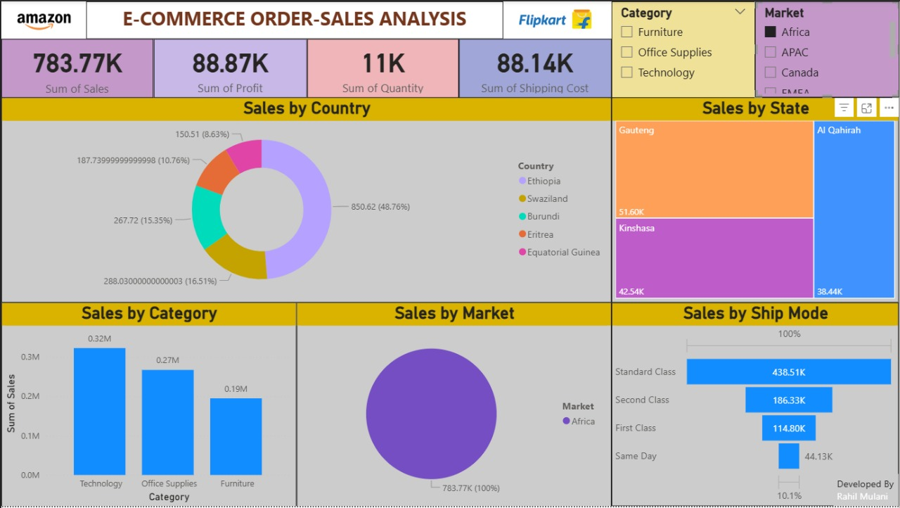
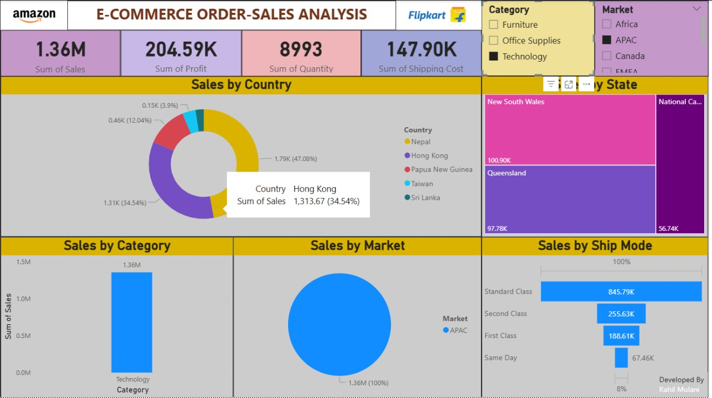

<h1 align="center">📊 E-Commerce Order-Sales Analysis Dashboard</h1>

  
  
  
  

  

---

## 🚀 Project Overview  
This project is an **interactive Power BI dashboard** designed to analyze **E-commerce sales performance**.  
It provides actionable insights into **sales, profit, shipping costs, and order quantities** across multiple **categories, markets, and regions**.  

---

## 🔑 Key Metrics  
- 💰 **Total Sales:** 12.64M  
- 📈 **Total Profit:** 1.47M  
- 📦 **Total Quantity:** 178K  
- 🚚 **Shipping Costs:** 1.35M  

---

## 📌 Dashboard Features  
✨ **Sales by Country** – Contribution of different countries  
✨ **Sales by State** – State-level breakdown (England, California, Ile-de-France)  
✨ **Sales by Category** – Comparison of Technology, Furniture & Office Supplies  
✨ **Sales by Market** – Regional performance (APAC, EU, US, LATAM, EMEA, Africa, Canada)  
✨ **Sales by Ship Mode** – Standard, Second Class, First Class & Same Day  

---

## 🛠️ Tools & Technologies  
- **Power BI Desktop** – Dashboard development  
- **Excel/CSV Dataset** – Data source  
- **DAX** – Custom measures & calculations  
- **Data Modeling** – Relationship building for analysis  

---

<h2 align="center">📊 Dashboard Preview</h2>

  

  

  

---

## 🎯 Business Insights  
🔹 **Technology** is the leading category with ~4.7M sales  
🔹 **APAC** region contributes the most (~28% of sales)  
🔹 **Standard Class shipping** dominates with 7.58M sales  
🔹 **England, California, and Ile-de-France** are top-performing states  

---

## 📬 Contact    

  
  
  

  

---

✨ If you found this project useful, please give it a ⭐ star to support my work! ✨

